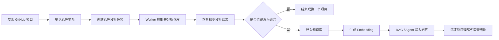

# RepoGuard

RepoGuard 是一个面向开发者的 GitHub 项目情报分析平台。它不是一个简单的“文档上传 + 问答”工具，而是一套围绕开源项目发现、仓库拉取、自动分析、知识沉淀、智能问答和代码审查展开的完整工作流系统。

你可以把它理解为一个开源项目研究助手：当你在 GitHub 上看到一个感兴趣的项目时，只需要把仓库地址交给 RepoGuard，它就可以自动拉取项目、生成初步分析、整理项目结构、识别技术栈和关键文件。后续如果你觉得这个项目值得深入研究，还可以把仓库内容导入知识库，生成向量索引，并通过 RAG 或 Agent 继续追问这个项目到底做什么、怎么运行、依赖什么、有哪些核心模块、代码质量如何。

## 项目定位

RepoGuard 解决的是一个很真实的问题：GitHub 上有大量值得研究的项目，但人工判断一个项目是否值得投入时间，通常需要反复翻 README、目录结构、依赖文件、核心代码和 Issue/配置。这个过程分散、重复，而且很容易漏掉关键信息。

RepoGuard 希望把这个过程平台化：

- 先快速判断一个仓库值不值得看。
- 再把值得看的项目沉淀成可搜索、可问答、可持续分析的知识资产。
- 最后通过 RAG、Agent 和代码审查能力，帮助你深入理解项目架构、功能边界和实现细节。

## 核心能力

### GitHub 仓库自动分析

- 支持输入 GitHub 仓库地址并创建异步分析任务。
- 后端自动拉取仓库内容，生成本地快照。
- 分析项目目录结构、文件分布、关键配置和技术栈线索。
- 输出项目摘要、依赖信息、文件统计、任务状态和错误信息。
- 适合用于快速判断一个开源项目是否值得深入研究。

### 异步任务与 Worker 体系

- 仓库分析任务由独立 Worker 执行，避免阻塞主 API。
- 支持任务租约、心跳、重试和失败恢复。
- 支持异常场景下的恢复验收流程，提升长任务稳定性。
- 支持故障注入测试，用于验证 Worker 在异常退出、租约过期等情况下的表现。
- 更适合处理耗时较长、容易受网络和仓库规模影响的分析任务。

### 知识库沉淀

- 支持知识库管理，把仓库分析结果和项目文件沉淀为长期资料。
- 支持文档上传和仓库内容导入。
- 支持将感兴趣的仓库绑定到知识库，形成项目级知识空间。
- 适合把多个项目、文档和分析结果整理到统一入口中。

### RAG 与 Agent 问答

- 支持围绕知识库内容进行 RAG 问答。
- 支持 Agent 聊天界面，用于更深入的问题拆解和项目理解。
- 可以追问项目用途、依赖关系、核心模块、启动方式、潜在风险等问题。
- 配合 Embedding 后，可以把仓库代码和文档转化为可检索的上下文。

### 代码审查工作台

- 提供代码审查对比界面，用于查看结构化 review 结果。
- 支持围绕代码变更、分析结论和审查信息进行更清晰的对照。
- 适合后续扩展为项目质量评估、风险提示和自动化 review 流程。

### 工程化基础

- 基于 FastAPI + React 的前后端分离架构。
- 使用 PostgreSQL 持久化业务数据。
- 使用 Docker Compose 一键启动完整本地环境。
- 包含后端、前端、数据库、仓库分析 Worker、Adminer、Mailcatcher 等服务。
- 保留测试、迁移、Compose 校验和验收测试脚本，便于继续扩展。

## 适合的使用场景

- 想快速判断一个 GitHub 项目是否值得深入研究。
- 想把多个开源项目整理成自己的技术知识库。
- 想围绕一个项目持续提问，而不是每次都重新翻代码。
- 想分析项目依赖、目录结构、核心模块和实现方式。
- 想为后续自动代码审查、项目评分、技术选型评估打基础。
- 想搭建一个属于自己的“开源项目研究中枢”。

## 当前完整流程



## 技术栈

- 后端：FastAPI、SQLModel、Alembic、PostgreSQL、Pytest。
- 前端：React、TypeScript、Vite、TanStack Router、Tailwind CSS、shadcn 风格组件。
- 任务处理：独立仓库分析 Worker、任务租约、心跳、恢复机制。
- 运行环境：Docker Compose。
- 包管理工具：后端使用 `uv`，前端使用 `bun`。

## 环境要求

- Docker Desktop，并支持 Docker Compose。
- Git。
- 可选本地开发工具：Python 3.10+、`uv`、`bun`。

## 快速启动

```bash
git clone <你的仓库地址>
cd full-stack-fastapi-template-master
cp .env.example .env
docker compose up --build
```

服务启动后可以访问：

- 前端：http://localhost:5173
- 后端 API：http://localhost:8000
- API 文档：http://localhost:8000/docs
- Adminer：http://localhost:8080
- Mailcatcher：http://localhost:1080

`.env.example` 中默认的本地管理员账号：

- 邮箱：`admin@example.com`
- 密码：`changethis`

如果要部署到公网，请务必修改 `.env` 中的 `SECRET_KEY`、`FIRST_SUPERUSER_PASSWORD`、`POSTGRES_PASSWORD` 等敏感配置。

## 关键配置

公开 GitHub 仓库可以不配置 Token 直接分析，但 GitHub API 会有更严格的限流。建议按需配置：

```env
GITHUB_TOKEN=github_pat_xxx
```

RAG、Agent 回答和向量生成需要配置对应的大模型与 Embedding 服务：

```env
LLM_API_KEY=
LLM_API_BASE=
LLM_MODEL=
EMBEDDING_API_KEY=
EMBEDDING_API_BASE=
EMBEDDING_MODEL=
```

请只把真实密钥放在本地 `.env` 或部署平台的 Secret Manager 中，不要提交到 GitHub。

## 第一次使用流程

1. 打开 http://localhost:5173 并登录。
2. 进入仓库分析页面。
3. 输入一个公开的 GitHub 仓库地址。
4. 等待仓库分析 Worker 完成任务。
5. 查看项目摘要、依赖信息、文件统计和分析状态。
6. 如果这个项目值得深入研究，将仓库内容导入或绑定到知识库。
7. 为知识库生成 Embedding。
8. 在知识库的 RAG 或 Agent 聊天界面继续提问。

## 常用命令

启动完整开发环境：

```bash
docker compose up --build
```

查看服务状态：

```bash
docker compose ps
```

查看后端和仓库分析 Worker 日志：

```bash
docker compose logs -f backend repository-analysis-worker
```

停止服务：

```bash
docker compose down
```

停止服务并删除本地数据库卷：

```bash
docker compose down -v
```

本地构建前端：

```bash
cd frontend
bun run build
```

本地检查后端入口和 Alembic 配置：

```bash
cd backend
uv run python -c "import app.main"
uv run alembic check
```

校验 Docker Compose 配置：

```bash
docker compose -f compose.yml -f compose.override.yml config --quiet
```

校验仓库恢复验收测试的 Compose 配置：

```bash
docker compose -f compose.yml -f docker-compose.repository-recovery.yml --profile acceptance config --quiet
```

## 上传 GitHub 前检查

- 提交 `.env.example`，不要提交 `.env`。
- 不要提交 `backend/storage/`、本地仓库快照、数据库 dump、`secrets/` 或生成的报告文件。
- API Key、GitHub Token、数据库密码等只放在本地 `.env` 或 GitHub Actions Secrets 中。
- 重要改动推送前，建议至少跑一次前端构建和后端配置检查。
- 如果启动方式、端口、环境变量发生变化，请同步更新 README。

## 项目价值

RepoGuard 的价值不只是“把代码拉下来”，而是把开源项目研究这件事拆成了一条更清晰的链路：发现项目、快速判断、结构化分析、知识库沉淀、智能问答、持续审查。

对于个人开发者，它可以作为自己的开源项目研究工作台。对于团队，它可以作为技术选型、项目调研和代码理解的基础平台。随着后续继续扩展，它还可以进一步演进为项目质量评估、自动化代码审查、开源项目雷达和团队知识管理系统。

## 说明

这个项目最初基于 FastAPI Full Stack Template，但当前业务重点已经调整为 GitHub 仓库分析、知识库管理和项目理解辅助。
